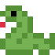
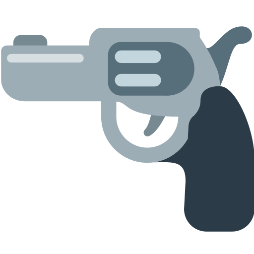
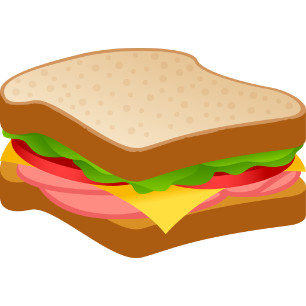

# Emoji Licensing Guide 📙

Welcome to the Emoji Licensing Repository! This project provides a detailed breakdown and categorization of popular emoji sets based on their licensing terms, making it easier for developers, designers, and organizations to understand which sets can be used for personal or commercial projects.

## Overview

This repository contains the following emoji sets:

- [Noto-Emoji](#noto-emoji)
- [Twemoji](#twemoji)
- [OpenMoji](#openmoji)
- [SerenityOS](#serenityos)
- [Mozilla](#mozilla)
- [Icons8](#icons8)
- [JoyPixels](#joypixels)
- [JoyPixels-Animations](#joypixels-animations)

> **Note**: The links to the full licensing terms for each emoji set are provided below and in the details section. Please review them to ensure compliance with the terms.

This repository contains approximately **11.4 GB** of data, organized as follows:

- The repository is divided into three main directories: `emoji`, `name`, and `unicode`.

  - **emoji**: Contains emoji files named visually by their respective emoji character (e.g., ⭐.png).
  - **name**: Contains emoji files named using descriptive names (e.g., `star.png`).
  - **unicode**: Contains emoji files named based on their Unicode representation (e.g., `2b50.png`).
  
- Inside each directory, you will find subfolders for each emoji set (e.g., `Noto-Emoji`, `Twemoji`).
- Each subfolder contains all published versions of the respective emoji set, not just the most recent version.

The table below summarizes the licensing information for each set:

## Emoji Set Licenses

| **Emoji Set**            | **License** | **Personal Use** | **Attribution Required** | **Modifications Allowed** | **Commercial Use**  | **Notes**                                                                        |
| ------------------------ | ----------------------------------------------------------------- | ---------------- | ------------------------- | -------------------------- | ------------------- | -------------------------------------------------------------------------------- |
| **Noto-Emoji**           | [SIL Open Font License 1.1](https://github.com/googlefonts/noto-emoji/blob/main/fonts/LICENSE)                                          | ✅ Yes            | ❌ No                     | ✅ Yes                                         | ✅ Yes               | Highly permissive; no attribution required.                                      |
| **Twemoji**              | [CC BY 4.0 License](https://github.com/twitter/twemoji/blob/master/LICENSE-GRAPHICS)                                                        | ✅ Yes            | ✅ Yes                    | ✅ Yes                                          | ✅ Yes               | Open-source; attribution required for use.                                       |
| **OpenMoji**             | [CC BY-SA 4.0 License](https://github.com/hfg-gmuend/openmoji/blob/master/LICENSE.txt)                                                      | ✅ Yes            | ✅ Yes                    | ✅ Yes                                          | ✅ Yes               | Open-source; attribution required; derivatives must retain license.              |
| **SerenityOS**           | [BSD 2-Clause License](https://github.com/linusg/serenityos-emoji-font/blob/main/LICENSE)                                                     | ✅ Yes            | ✅ Yes                    | ✅ Yes                                           | ✅ Yes               | Redistribution allowed with copyright notice.                                    |
| **Mozilla**              | [CC BY 4.0 / Apache 2.0](https://github.com/mozilla/fxemoji/blob/gh-pages/LICENSE.md)                                             | ✅ Yes            | ✅ Yes                    | ✅ Yes                                           | ✅ Yes               | Attribution required; some assets under Apache 2.0 license.                      |
| **Icons8**               | [Custom Licensing Agreement](https://intercom.help/icons8-7fb7577e8170/en/articles/5534926-universal-multimedia-license-agreement-for-icons8)                                                  | ✅ Yes                               | ❌ No                      | ⚠️ Limited                 | ⚠️ Requires license | Free for non-commercial use with attribution; commercial use requires payment.   |
| **JoyPixels**            | [JoyPixels Licensing](https://joypixels.com/licenses)                                                  | ✅ Yes            | ❌ No                     | ❌ No                      | ⚠️ Limited                 | Free for personal use; commercial use requires a license.                        |
| **JoyPixels-Animations** | [JoyPixels Licensing](https://joypixels.com/licenses)                                                 | ✅ Yes            | ❌ No                     | ❌ No                      | ⚠️ Limited                 | Same rules as static JoyPixels; animations require a license for commercial use. |

## Details for Each Emoji Set

### [Noto-Emoji](https://github.com/googlefonts/noto-emoji/blob/main/fonts/LICENSE)

- **License**: SIL Open Font License 1.1.
- **Use Restrictions**: Commercial and personal use allowed. Highly permissive with no attribution required.

  &nbsp;&nbsp;&nbsp;&nbsp;&nbsp;&nbsp;&nbsp;&nbsp;&nbsp;&nbsp;&nbsp;&nbsp;&nbsp;&nbsp;&nbsp;

### [Twemoji](https://github.com/twitter/twemoji/blob/master/LICENSE-GRAPHICS)

- **License**: CC BY 4.0.
- **Use Restrictions**: Commercial and personal use allowed with attribution.

  &nbsp;&nbsp;&nbsp;&nbsp;&nbsp;&nbsp;&nbsp;&nbsp;&nbsp;&nbsp;&nbsp;&nbsp;&nbsp;&nbsp;&nbsp;

### [OpenMoji](https://github.com/hfg-gmuend/openmoji/blob/master/LICENSE.txt)

- **License**: CC BY-SA 4.0.
- **Use Restrictions**: Commercial and personal use allowed with attribution. Derivatives must be licensed under the same terms.

  &nbsp;&nbsp;&nbsp;&nbsp;&nbsp;&nbsp;&nbsp;&nbsp;&nbsp;&nbsp;&nbsp;&nbsp;&nbsp;&nbsp;&nbsp;

### [SerenityOS](https://github.com/linusg/serenityos-emoji-font/blob/main/LICENSE)

- **License**: BSD 2-Clause.
- **Use Restrictions**: Commercial and personal use allowed with attribution. Redistribution must include a copyright notice.

  &nbsp;&nbsp;&nbsp;&nbsp;&nbsp;&nbsp;&nbsp;&nbsp;&nbsp;&nbsp;&nbsp;&nbsp;&nbsp;&nbsp;&nbsp;

### [Mozilla](https://github.com/mozilla/fxemoji/blob/gh-pages/LICENSE.md)

- **License**: CC BY 4.0 / Apache 2.0.
- **Use Restrictions**: Commercial use allowed with attribution. Some assets may be governed by the Apache 2.0 license.

  &nbsp;&nbsp;&nbsp;&nbsp;&nbsp;&nbsp;&nbsp;&nbsp;&nbsp;&nbsp;&nbsp;&nbsp;&nbsp;&nbsp;&nbsp;

### [Icons8](https://intercom.help/icons8-7fb7577e8170/en/articles/5534926-universal-multimedia-license-agreement-for-icons8)

- **License**: Custom licensing.
- **Use Restrictions**: Free for non-commercial use with attribution. Commercial use requires a license.

  &nbsp;&nbsp;&nbsp;&nbsp;&nbsp;&nbsp;&nbsp;&nbsp;&nbsp;&nbsp;&nbsp;&nbsp;&nbsp;&nbsp;&nbsp;

### [JoyPixels](https://joypixels.com/licenses)

- **License**: Custom licensing.
- **Use Restrictions**: Free for personal, non-commercial use. Commercial use requires a license.

  &nbsp;&nbsp;&nbsp;&nbsp;&nbsp;&nbsp;&nbsp;&nbsp;&nbsp;&nbsp;&nbsp;&nbsp;&nbsp;&nbsp;&nbsp;

### [JoyPixels-Animations](https://joypixels.com/licenses)

- **License**: Custom licensing.
- **Use Restrictions**: Same rules as static JoyPixels; animations require a license for commercial use.

  &nbsp;&nbsp;&nbsp;&nbsp;&nbsp;&nbsp;&nbsp;&nbsp;&nbsp;&nbsp;&nbsp;&nbsp;&nbsp;&nbsp;&nbsp;

## Disclaimer
This repository is for informational purposes only. I am not affiliated with or endorsed by any of the companies or projects mentioned. If you represent a company and wish to have your content removed, please contact me, and I will address your request promptly.

## Contributions

Contributions are welcome! If you find any errors or have updates to share, feel free to open an issue or submit a pull request.

## License

This repository is licensed under the [MIT License](LICENSE).  
However, please note that the emojis included in this repository are subject to their own licenses, as listed below:

- **[Noto Emoji](https://github.com/googlefonts/noto-emoji/blob/main/fonts/LICENSE)**: SIL Open Font License 1.1
- **[Twemoji](https://github.com/twitter/twemoji/blob/master/LICENSE-GRAPHICS)**: CC BY 4.0
- **[OpenMoji](https://github.com/hfg-gmuend/openmoji/blob/master/LICENSE.txt)**: CC BY-SA 4.0
- **[SerenityOS Emoji](https://github.com/linusg/serenityos-emoji-font/blob/main/LICENSE)**: BSD 2-Clause
- **[Mozilla Emoji](https://github.com/mozilla/fxemoji/blob/gh-pages/LICENSE.md)**: CC BY 4.0 / Apache 2.0
- **[Icons8](https://intercom.help/icons8-7fb7577e8170/en/articles/5534926-universal-multimedia-license-agreement-for-icons8)**: Custom licensing Agreement
- **[JoyPixels](https://joypixels.com/licenses)**: JoyPixels Licensing
- **[JoyPixels Animations](https://joypixels.com/licenses)**: JoyPixels Licensing

